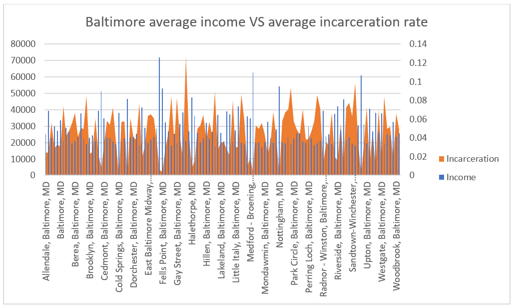
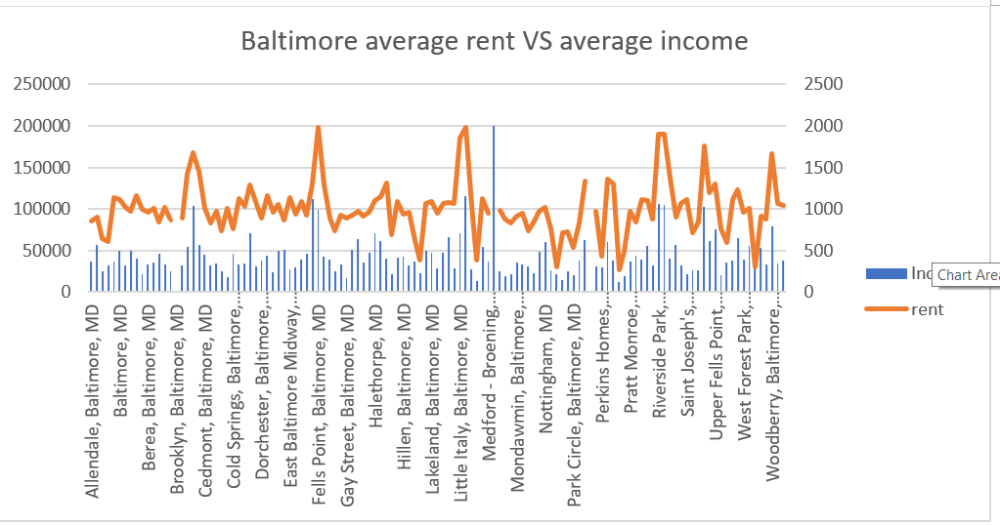
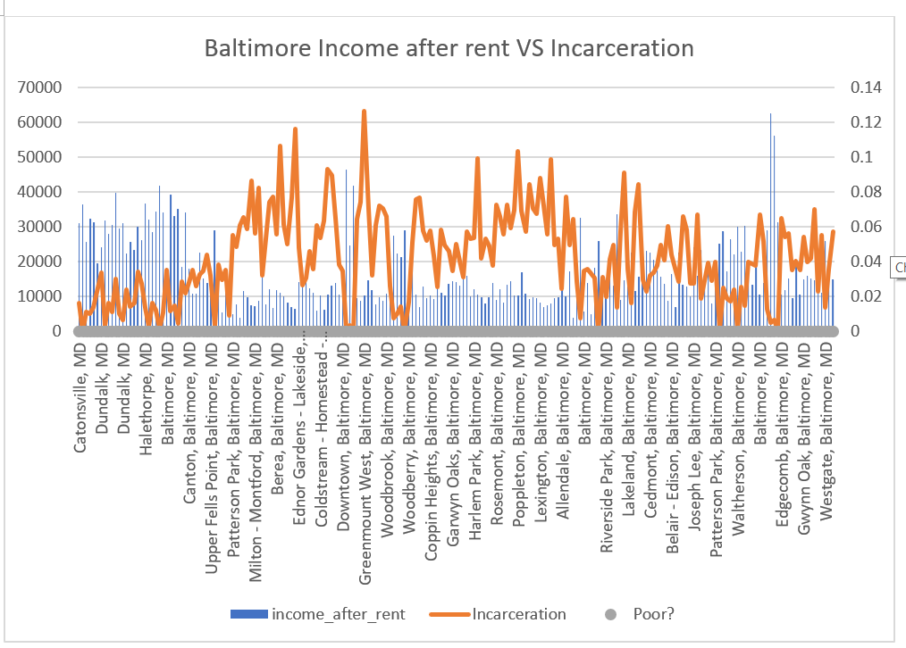
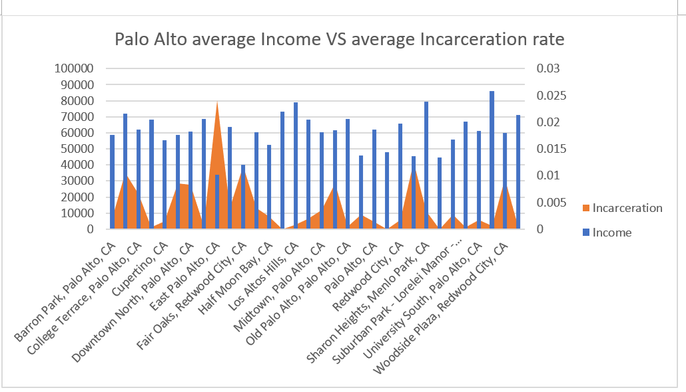
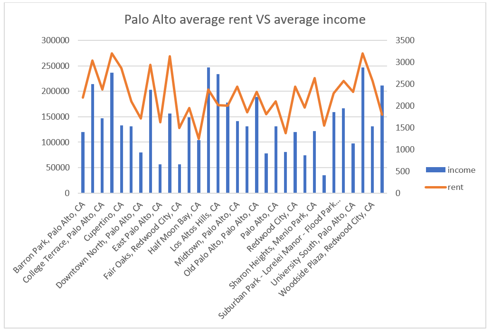
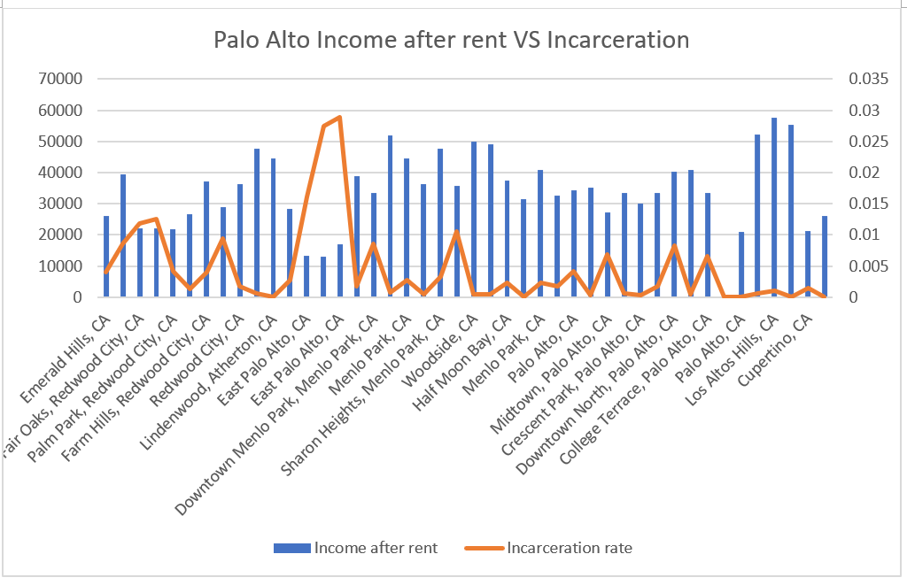

# Mini Project 1: Comparing how rent influences income and incarceration rate between Baltimore and Palo Alto

# Summary of the project 

The project shows the relationship between average household income and incarceration rate in both Baltimore and Palo Alto, and further normalizes the income with the median rent at each place to figure out whether the rent is a big factor in this relationship. The result from data analysis shows that there is a negative relationship between Average household income and incarceration rate which means when the average household income is high, the average incarceration rate will be low. Also, median rent can make the relationship more obvious by substracting extra amount of money form the income. This can be really useful in determining whether the government should issue social welfare in certain areas to reduce the crime and violence. Moreover, this project can be used to decide whether a household would have to lead an economical way of life (has net income < 10000 USD), which can be an indication of a low income family. After people have certain ideas of what the result is like, they can continue to work on how much social walfare should be invested on the development of certain areas when more data is available. 

# Step-by-Step Analysis 

## Data Selection 

- It takes some time to figure out how Opportunity Atlas works. The preset counties and tracts are not quite useful because it will give the result of the entire United States, which is not what reqired for this project. Then, I decided to use the "Just what is on the screen" to get the 210 records of data for Baltimore and 45 records of data for Palo Alto. Moreover, then for the neighborhood information, we need to get the corresponding neighborhood data by scrolling down to the very end of the page and select what we really need for the project. 

## Data Preprocessing 
- We removed empty columns and clean all empty cells in order to make sure that we won't have problems when running the program. If there are some issues like something doesn't work, please email me at zwang191 @ jhu .edu 

## Data Analysis

- Read the document online about all the data collected by tracts and use the specific rows or columns to do the operation. In this case, we used several pivotTables to get the relationship, VLOOKUP to get the median rent from other files, do the if statement to check if the net income after paying the rent can make the household poor or not. 

# File Specification 
- All the data is in the `data` folder

- `all_general.xlsx`: This file contains full information for every state in the United States but for my prooject, I only choose Baltimore becuase it is our target and San Francisco becuase it is near Palo Alto. In this file, it contains another pivot table for the comparison on kfr (Mean household income rank for children whose parents were at the 25th percentile of the national income distribution) and jail (Fraction of children born in 1978-1983 birth cohorts with parents at the 25th percentile of the national
income distribution who were incarcerated on April 1st, 2010) 

- `all_neighborhood.xlsx`: This file contains all the neighborhood information for every state in the United States, and I also filtered it for Baltimore and San Francisco for my project purpose only. There is a pivot table in this file as well because I would like to compare the average income and the average rent. Thorugh these information, we can see the normalization of rent on the total income. 

- `Baltimore_general.xlsx`: This file is what I chose based on the tract in the screen and it contains any information for Baltimore. I created a table in this file to show the normalization of rent on household income. Since there is no data in this file for rent, I have to do `VLOOKUP` for this purpose, so make sure you open both `Baltimore_general.xlsx` and `Baltimore_neighborhood.xlsx` for getting the correct data representation. There is another pivot table in this file to show directly the negative relationship between average household income and average incarceration rate. 

- `Baltimore_neighborhood.xlsx`: This file contains all the information about the neighborhood information for Baltimore. There is a pivot table in doing the relationship between rent and household income to show there is a positive relationship. 

- `PaloAlto_general.xlsx`: This file is similar to `Baltimore_general.xlsx` but it is for Palo Alto. Also, remember to open this with `PaloAlto_neighborhood.xlsx`, otherwise, the result won't show up.

- `PaloAlto_neighborhood.xlsx`: This file is similar to `Baltimore_neighborhood.xlsx` but it is for Palo Alto. 

# Data Visualization 

- 
- 
- 
- 
- 
- 

# Discussion and Limitation
- The result from this project shows a obvious negative relationship between the income after normalization by rent and incarceration rate. This might indicate that more wealth can make people obey the social norms. But there are also some limitations on this topic. 

- First, not all people rent their house, so the calculation might generate some discrepency on this issue. But due to the lack of data on the proporation of the population who rent the house, we cannot make more convincing claim, but this should be definitely one of the future research focus. 

- Also, I have to admit that the amount of data in the file is not enough since it only has less than 1,000 records. But after we get more data, we can make sure that the claim should be more accurate on the goal of my project. 

- Overall, the result of this project is decent in showing the trend on the income vs the incarceration rate. And I hope in the future, I can refine this argument to be more accurate by collecting more data in the future. 